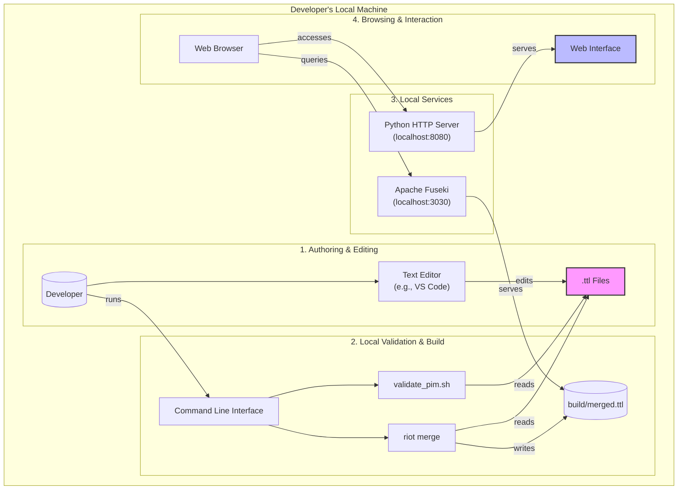

# Deployment Architecture

## Purpose
This diagram illustrates the typical local "deployment" for a developer working on the `pim_rdf` project. It shows the tools and processes involved in authoring data, validating it, serving it, and interacting with it through the web interface.

## Diagram

## Key Components
- **Authoring & Editing**: The developer uses a text editor to create and modify the raw `.ttl` data files.
- **Local Validation & Build**: The developer uses the command line to run validation scripts (`validate_pim.sh`) and merge the individual `.ttl` files into a single `build/merged.ttl` file using Apache Jena's `riot` tool.
- **Local Services**: Two local servers are run:
    - **Apache Fuseki**: A SPARQL server that loads the `merged.ttl` file and exposes a SPARQL endpoint for querying.
    - **Python HTTP Server**: A simple web server to serve the static files for the Web Interface (`web/` directory).
- **Browsing & Interaction**: The developer uses a web browser to view the web interface, which in turn sends SPARQL queries to the Fuseki server to fetch and display data.

## Notes
- This entire workflow runs on a single local machine. There is no cloud deployment.
- The `README.md` provides detailed commands for starting the required services.

## Related Diagrams
- [System Architecture Overview](./system-overview.md)
- [SPARQL Query Flow](../sequences/sparql-query-flow.md)
