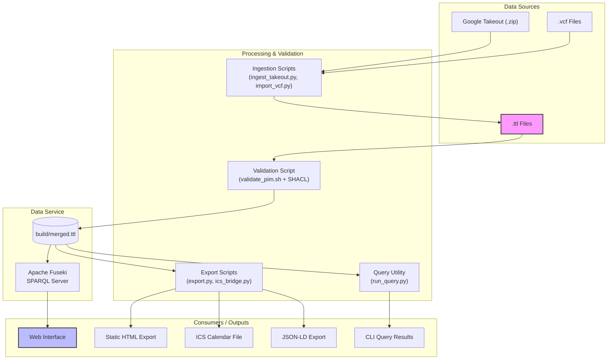

# System Architecture Overview

## Purpose
This diagram provides a high-level overview of the `pim_rdf` system architecture. It shows the flow of data from various sources, through processing and validation, to the final consumption layers like the web interface and static exports.

## Diagram

## Key Components
- **Data Sources**: The raw data for the knowledge base. This includes manually created `.ttl` files and data imported from external sources like Google Takeout or VCF files.
- **Processing & Validation**: A collection of Python and shell scripts that handle data ingestion, validation against SHACL shapes, and exporting to various formats.
- **Data Service**: The core of the system where the merged and validated RDF data is stored and served via an Apache Fuseki SPARQL server.
- **Consumers / Outputs**: The various ways the data can be accessed and used, including an interactive web interface, command-line queries, and static file exports (HTML, JSON-LD, ICS).

## Notes
- The system is designed to be modular and file-based, with Git being the primary tool for versioning and synchronization.
- The `build/merged.ttl` file is a generated artifact that combines all individual `.ttl` files for easier querying.

## Related Diagrams
- [Deployment Architecture](./deployment.md)
- [Data Processing Pipeline](../flows/data-pipeline.md)
