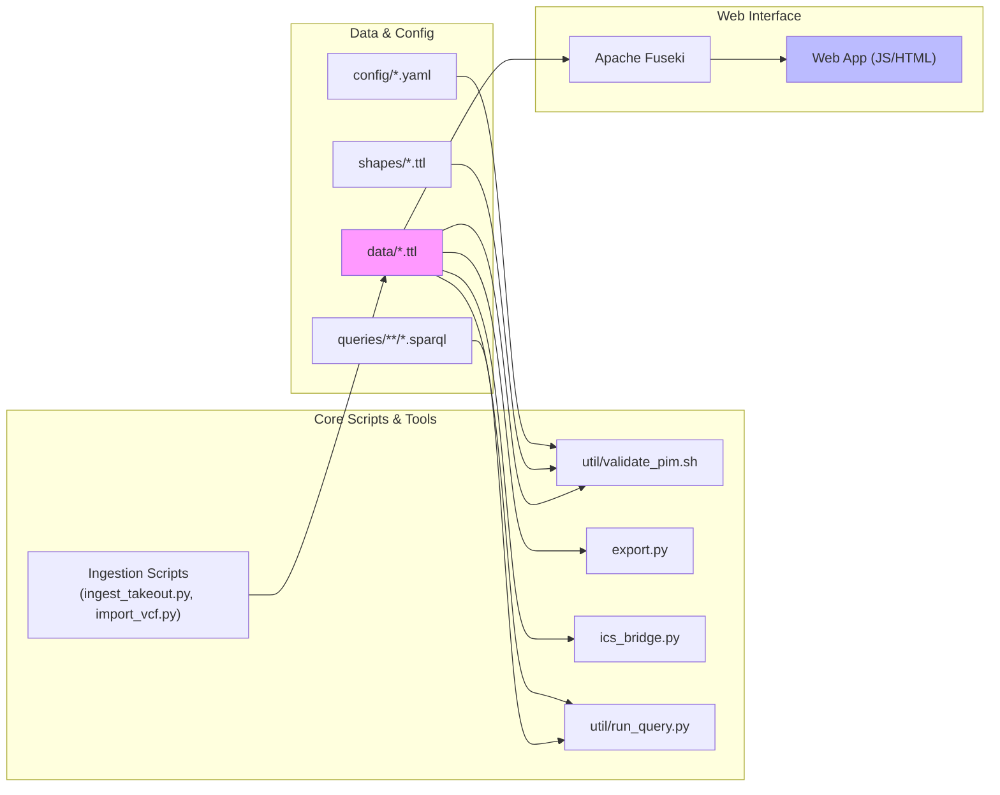

# Module Dependencies

## Purpose
This diagram shows the dependencies between the various modules, scripts, and data components of the `pim_rdf` project. It helps in understanding how changes in one part of the system might affect others.

## Diagram

## Key Components
- **Data & Config**: The declarative part of the system. This includes the core RDF data (`.ttl` files), YAML configuration files, SHACL shapes for validation, and SPARQL queries.
- **Core Scripts & Tools**: The imperative part of the system. These are scripts that perform actions like validating data, importing new data from external sources, or exporting data to different formats.
- **Web Interface**: The user-facing component, which consists of a backend SPARQL server (Apache Fuseki) and a frontend web application.

## Notes
- The arrows indicate a dependency. For example, the `Validation` script depends on `Config`, `Shapes`, and `Data TTL` files to perform its function.
- The `Data TTL` files are central to the system, as almost every component either reads from or writes to them.

## Related Diagrams
- [System Architecture Overview](../architecture/system-overview.md)
- [Class Relationships](./class-diagram.md)
