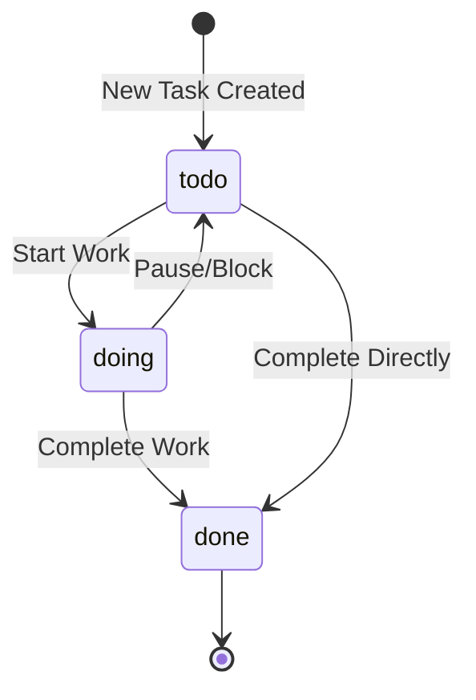

# Task State Machine

## Purpose
This diagram shows the lifecycle of a task (`pim:Task` or `schema:Action`) in the system. It illustrates the possible statuses a task can have and the transitions between them.

## Diagram

## Key States
- **todo**: The initial state for a new task. The work has not yet started.
- **doing**: The task is actively being worked on.
- **done**: The task has been completed.

## Transitions
- **New Task Created**: A new task is created and enters the `todo` state.
- **Start Work**: A user begins working on a task, moving it from `todo` to `doing`.
- **Pause/Block**: Work on a task is paused, moving it from `doing` back to `todo`.
- **Complete Work**: A task that was in progress is finished, moving it to the `done` state.
- **Complete Directly**: A task is completed without ever being in the `doing` state.
- **(end)**: Once a task is done, it reaches its terminal state.

## Notes
- The state of a task is stored in the `pim:status` property.
- The SHACL shapes in `shapes/` may enforce that the `pim:status` property must be one of these values.

## Related Diagrams
- [Class Relationships Diagram](../components/class-diagram.md)
