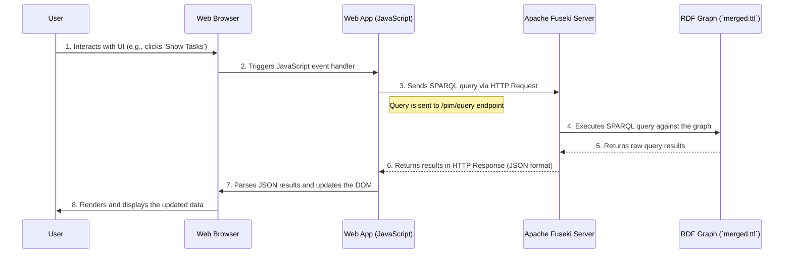

# SPARQL Query Flow

## Purpose
This diagram illustrates the sequence of events that occur when a user interacts with the web interface to query and view data. It shows the communication between the browser, the web application's JavaScript, and the backend SPARQL server.

## Diagram

## Key Participants
- **User**: The person interacting with the system.
- **Web Browser**: Renders the HTML and executes the JavaScript of the web application.
- **Web App (JavaScript)**: The client-side code that handles user interactions, constructs SPARQL queries, communicates with the backend, and manipulates the DOM.
- **Apache Fuseki Server**: The backend SPARQL server that receives queries, executes them against the data, and returns results.
- **RDF Graph (`merged.ttl`)**: The actual data store that is queried by Fuseki.

## Notes
- This flow describes how the interactive web dashboard (`web/index.html`) works.
- A similar, but simpler, flow occurs when using the command-line query tool (`util/run_query.py`), where the script acts as the client instead of the browser and web app.

## Related Diagrams
- [Deployment Architecture](../architecture/deployment.md)
- [System Architecture Overview](../architecture/system-overview.md)
