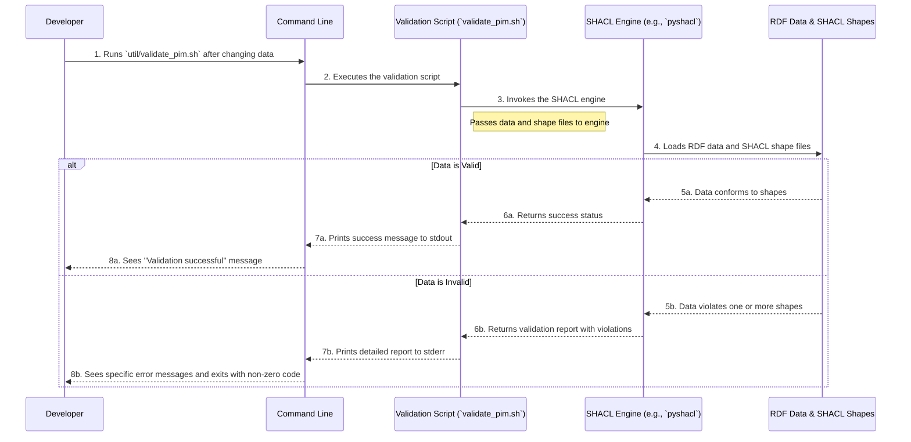

# Validation Flow

## Purpose
This diagram shows the sequence of events for validating the RDF data against a set of rules (SHACL shapes). It illustrates how the `validate_pim.sh` script works and how errors are reported.

## Diagram

## Key Participants
- **Developer**: The user who modified the data and wants to check its validity. This role is played by the CI pipeline in automated workflows.
- **Command Line (CLI)**: The interface through which the user runs the script.
- **Validation Script (`validate_pim.sh`)**: The main script that orchestrates the validation process.
- **SHACL Engine**: The underlying tool (e.g., `pyshacl`) that performs the actual validation of data against shapes.
- **Files**: The RDF data files (`.ttl`) and the SHACL shape files (`.ttl`) that serve as input to the engine.

## Notes
- This validation process is crucial for maintaining data quality and consistency in the knowledge base.
- The GitHub Actions CI pipeline runs this script automatically on every push and pull request, preventing invalid data from being merged.

## Related Diagrams
- [Data Processing Pipeline](../flows/data-pipeline.md)
